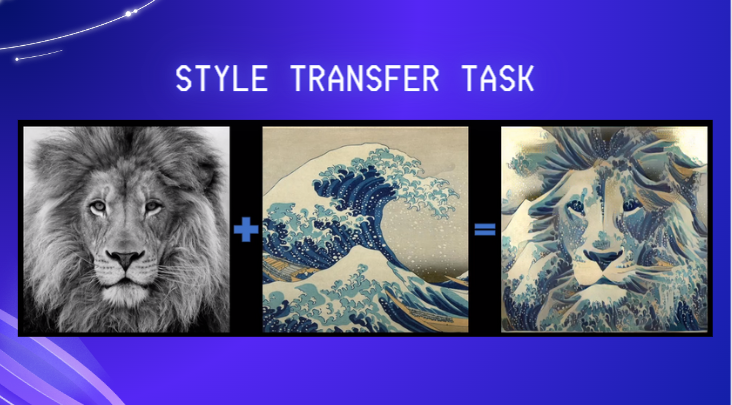

# Neural-Style-Transfer-Pytorch
Neural Style Transfer using Pytorch framework.

Reference: [Neural Style Transfer Paper](https://www.cv-foundation.org/openaccess/content_cvpr_2016/papers/Gatys_Image_Style_Transfer_CVPR_2016_paper.pdf?fbclid=IwAR2S2XPJ5k3iEsEzSLXdNIZlIbJAUhxyGXcYMWZmHVW0MQZ9cj1i1-58-Ho)

Author: [Pham Nguyet](https://github.com/phamnguyet2003)